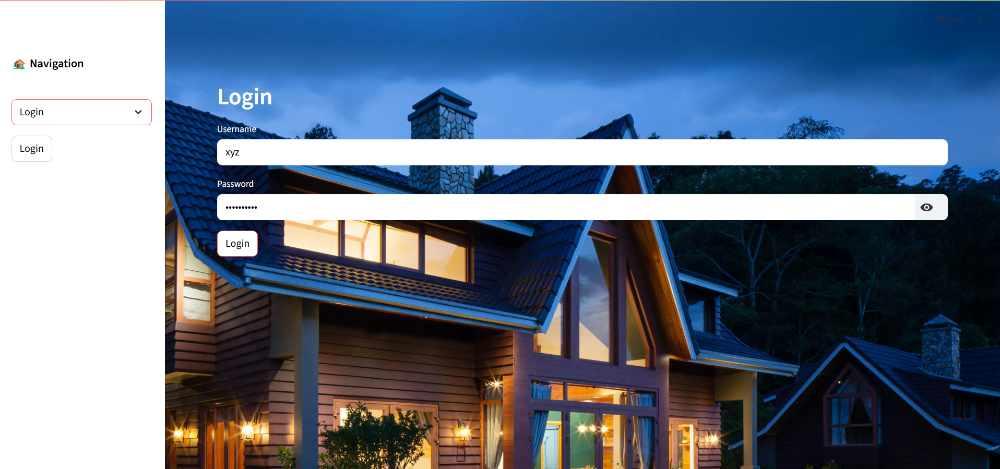
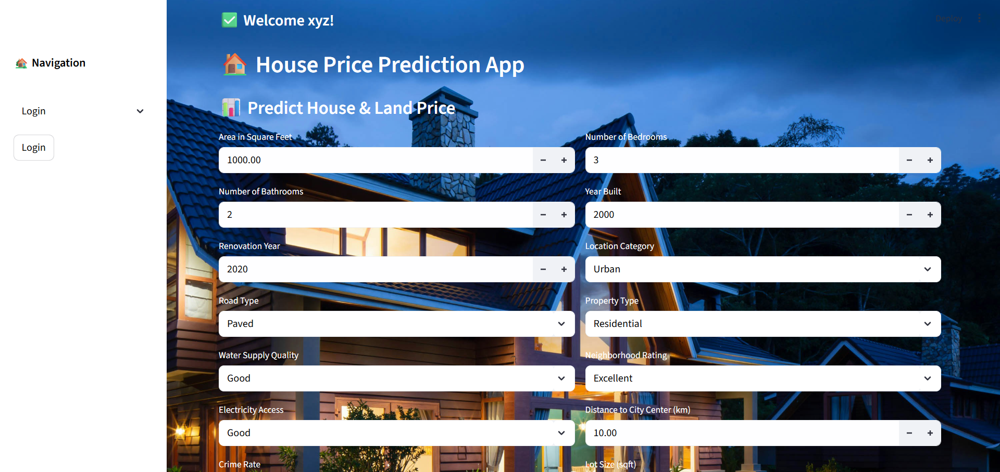
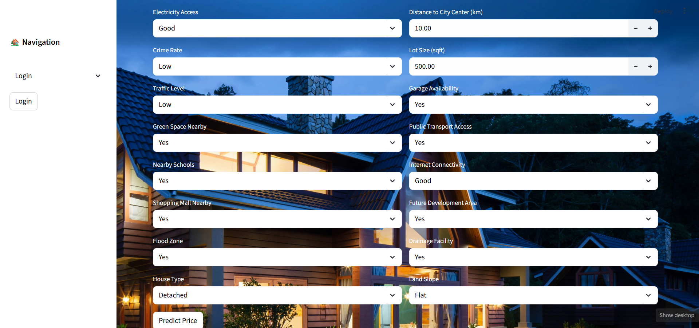
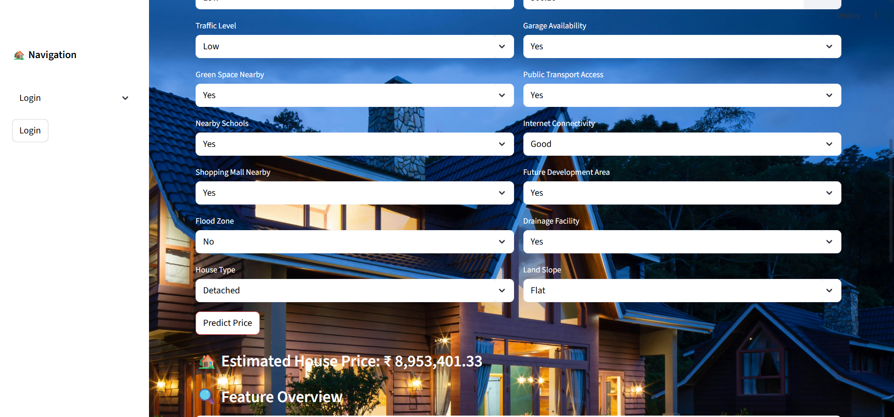
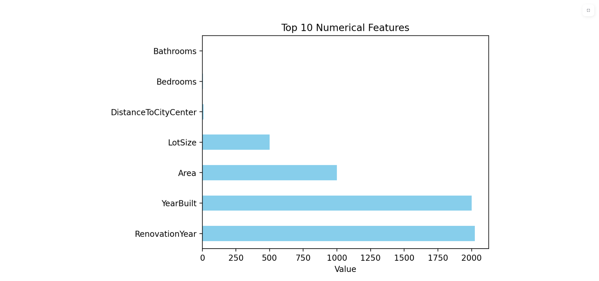
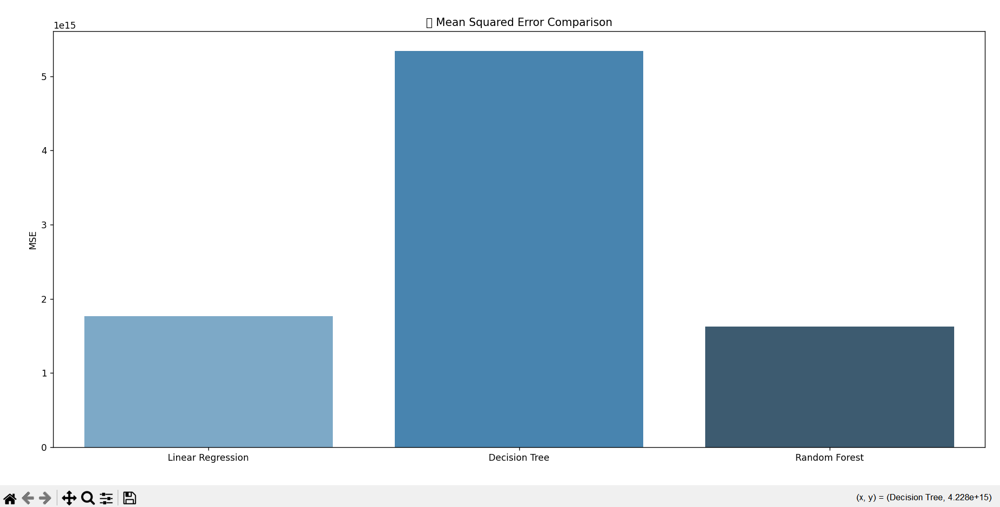
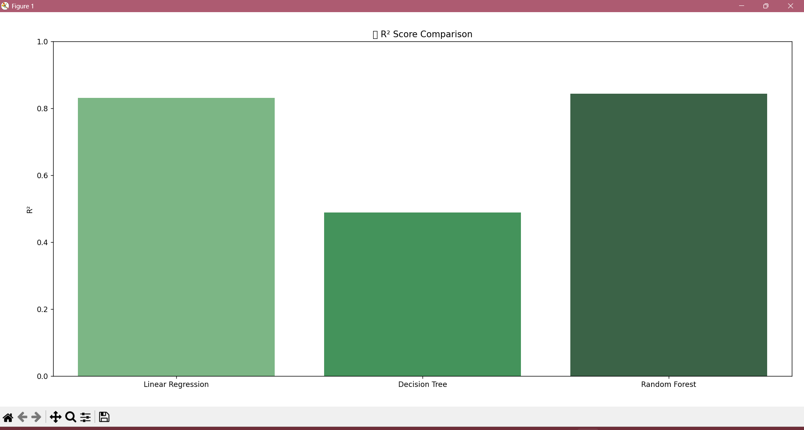
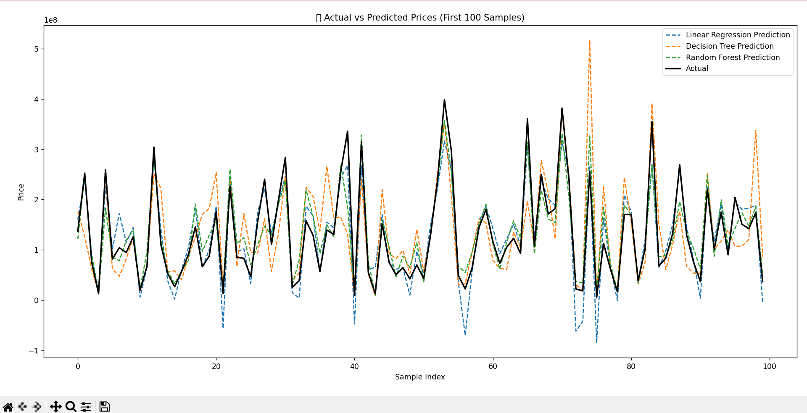
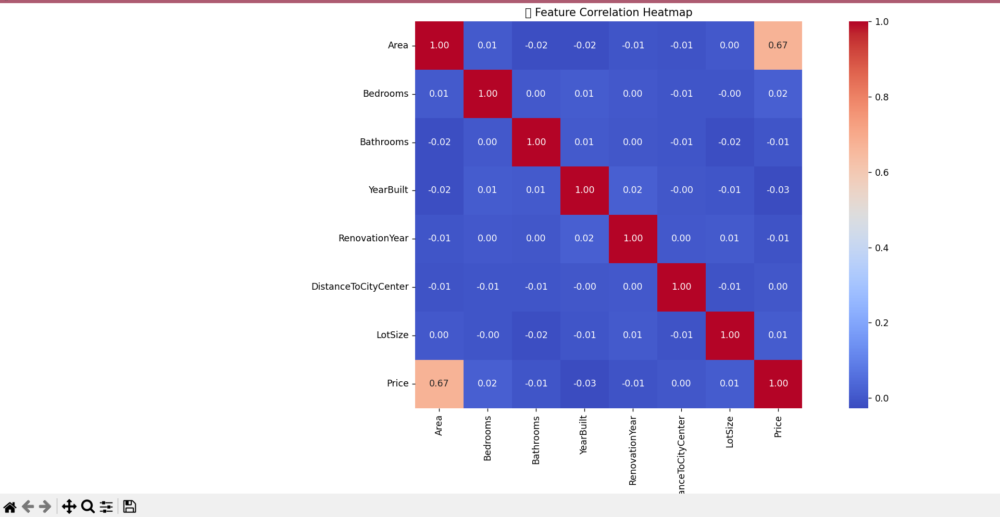

# 🏠 House Price Prediction App


A fully functional web-based **House & Land Price Prediction App** built using **Streamlit**, **Machine Learning**, and a custom authentication system. The app predicts house prices based on 25 real-estate and urban planning features.

---

## 🚀 Features

- 🔐 Login & Signup Authentication (with hashed password)
- 🧠 Machine Learning Model (Random Forest Regressor)
- 📊 Predict House Prices from 25 factors
- 🌃 Modern UI with background images and white text overlay
- 📸 Screenshots & 🎥 Demo video
- 🔄 Remembers session (username shown after login)
- 📈 Top 10 features shown in bar graph post prediction

---

## 🖼️ Screenshots

### 🔐 Login Page


### 🏘️ Prediction Form



### 📈 Prediction Result with Graph






---

## 🎥 Demo Video

[](https://www.youtube.com/watch?v=YOUR_VIDEO_ID)

> 🎯 Replace `YOUR_VIDEO_ID` with your actual YouTube video ID.

---

## 📁 Folder Structure

## 🛠️ Tech Stack

| Layer        | Technologies Used                        |
|--------------|-------------------------------------------|
| Frontend     | Streamlit, HTML/CSS, Matplotlib, Seaborn |
| Backend      | Python, Pandas, scikit-learn, bcrypt      |
| Model        | Random Forest Regressor                  |
| Deployment   | Streamlit Cloud / Localhost              |

---

## 📂 Project Structure

house-price-prediction-app/
│
├── app.py # Streamlit frontend
├── train_model.py # Model training script
├── model/
│ └── house_price_model.pkl # Trained Random Forest model
├── users.csv # User credentials
├── assets/
│ └── screenshot.png # Screenshots/images
├── README.md # Project overview
└── requirements.txt # Python dependencies


---

## ⚙️ Setup Instructions

### 🔧 Local Installation

```bash
# Clone the repository
git clone https://github.com/your-username/house-price-prediction-app.git
cd house-price-prediction-app

# Install dependencies
pip install -r requirements.txt

# Train the model (optional)
python train_model.py

# Run the app
streamlit run app.py
🖼️ Screenshots
🔐 Login Page

📊 Prediction Output

📌 Future Enhancements
📥 Download prediction results as CSV

🧠 Add explainable AI (e.g., SHAP values)

🌐 Host user history and admin dashboard

🙋‍♀️ Author
Aishwarya Shrivastava
📍 BIT Durg | AI Enthusiast | Python & ML Developer
📫 Contact: aishwaryashrivastava2004@gmail.com

## 📜 License  
This project is licensed under the [MIT License](LICENSE).
